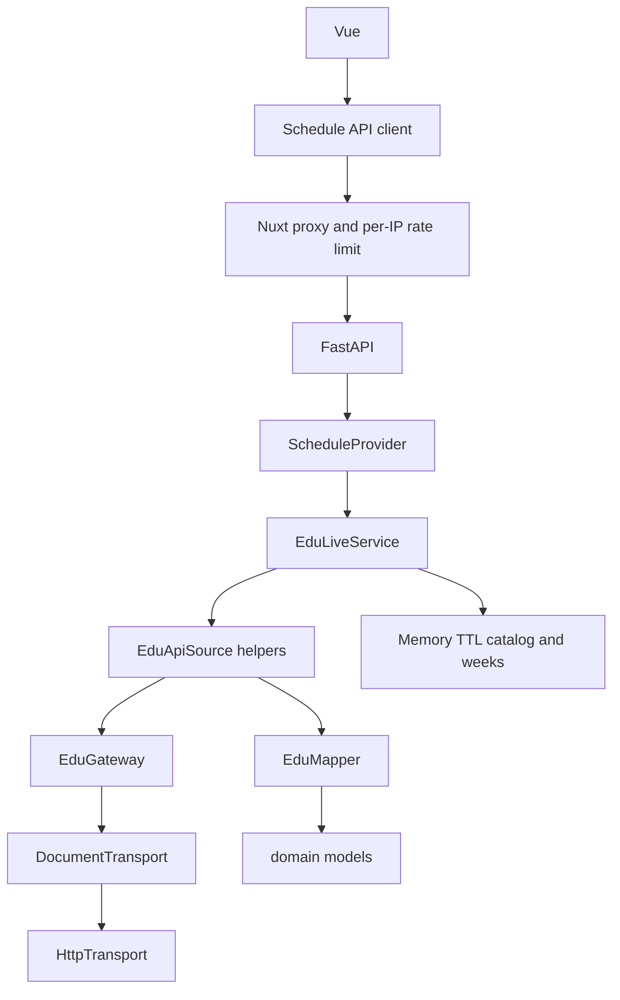

# Архитектура Misisync

Фронтенд работает с календарным контрактом Misisync. Активный бэкенд — live JSON-RPC к `edu.misis.ru`. Источник расписания подключается через порт провайдера; HTTP-транспорт отделён от маппинга.

## Расширение / смена бэкенда

1. Реализовать `ScheduleProvider` (`catalog` / `schedule` / `status`) в новом модуле.
2. Добавить ветку в [`composition.build_provider`](../backend/app/composition.py).
3. Маршруты FastAPI и фронтенд не менять, пока контракт `domain.py` тот же.

Опционально для офлайн/batch-инструментов: `ScheduleSource.fetch(transport, window) -> Snapshot` (как `EduApiSource.fetch` + HAR replay). Это не путь HTTP-сервера.

`SourceInfo.basis` допускает `dated` и `weekly_template` на будущее; сейчас используется только `dated`.

## Границы

| Модуль | Отвечает за | Не делает |
| --- | --- | --- |
| `domain.py` | Календарный контракт | Сеть |
| `ports.py` | `ScheduleProvider`, `DocumentTransport`, опциональный batch `ScheduleSource` | Реализации |
| `transports/http.py` | HTTP, таймауты, лимит размера | JSON-RPC / календарь |
| `sources/edu/gateway.py` | JSON-RPC envelope | Календарные правила |
| `sources/edu/mapper.py` | Время, подгруппы, неоднозначности | HTTP |
| `sources/edu/source.py` | Каталог и недельный `getSchedule` | Публичные маршруты |
| `sources/edu/live.py` | TTL-кэш и ответы для UI | Persistence |
| `composition.py` | Создание провайдера, общий HTTP-клиент и предел параллельных обращений | Календарные правила |
| `main.py` | HTTP-контракт | Выбор алгоритма источника |

## Контракт

- `GET /api/groups` — `{revision, groups}`
- `GET /api/schedule?group_id=&start=&end=` — календарь на окно (≤ 91 день)
- `GET /api/status` — метаданные live-провайдера
- `GET /api/health` — liveness

Каталог: `getFillialInfo` + TTL. Расписание: `getSchedule` по запрошенным неделям + TTL. `EDU_GROUPS` фильтрует только имена в каталоге.

- Кэш недель ограничен `EDU_SCHEDULE_CACHE_MAX_ENTRIES`; вытесняется давно не использованная запись. Ключ — upstream ID группы и понедельник недели.
- Совпадающие запросы ждут одну общую задачу. Отключение одного клиента не отменяет её для остальных. Таблица выполняемых задач очищается после успеха, ошибки и остановки приложения.
- Различные задачи ограничены `EDU_MAX_PENDING_REQUESTS`; при заполнении API отвечает 503 с `Retry-After`. Общий HTTP-клиент ограничивает параллельные обращения через `EDU_MAX_CONCURRENT_REQUESTS` и закрывается при остановке приложения.
- TTL отсчитывается от завершения загрузки. При ошибке допустим старый ответ в пределах `EDU_STALE_IF_ERROR_SECONDS` после TTL, включая успешно полученную пустую неделю. Ошибка не продлевает этот срок. Повторные попытки ограничены `EDU_RETRY_BACKOFF_SECONDS`.
- `Schedule.fetched_at` — время самой старой успешной загрузки среди недель ответа. `stale=true` и `warnings` явно отмечают возврат старого расписания при сбое. `status` сообщает состояние каталога без запуска сетевого запроса; время каталога не подменяет время расписания.
- Лимит на IP действует в публичном Nuxt-прокси (`NUXT_SCHEDULE_RATE_LIMIT_PER_MINUTE`), а не на FastAPI, которому все посетители приходят от Nuxt. Хранилище IP ограничено 4096 активными адресами; при заполнении новые адреса временно получают 429. Доверие к внешнему прокси настраивается явно, см. README.

Всё состояние хранится в памяти одного процесса. После перезапуска источник должен быть доступен для первой загрузки. Для текущего сценария просмотра расписания это осознанное ограничение; постоянное хранилище понадобилось бы для истории изменений или работы после перезапуска при недоступном университете.

Неизвестная группа: `group=null`, пустые даты. Воскресенье не входит в покрытие источника (пн–сб).
