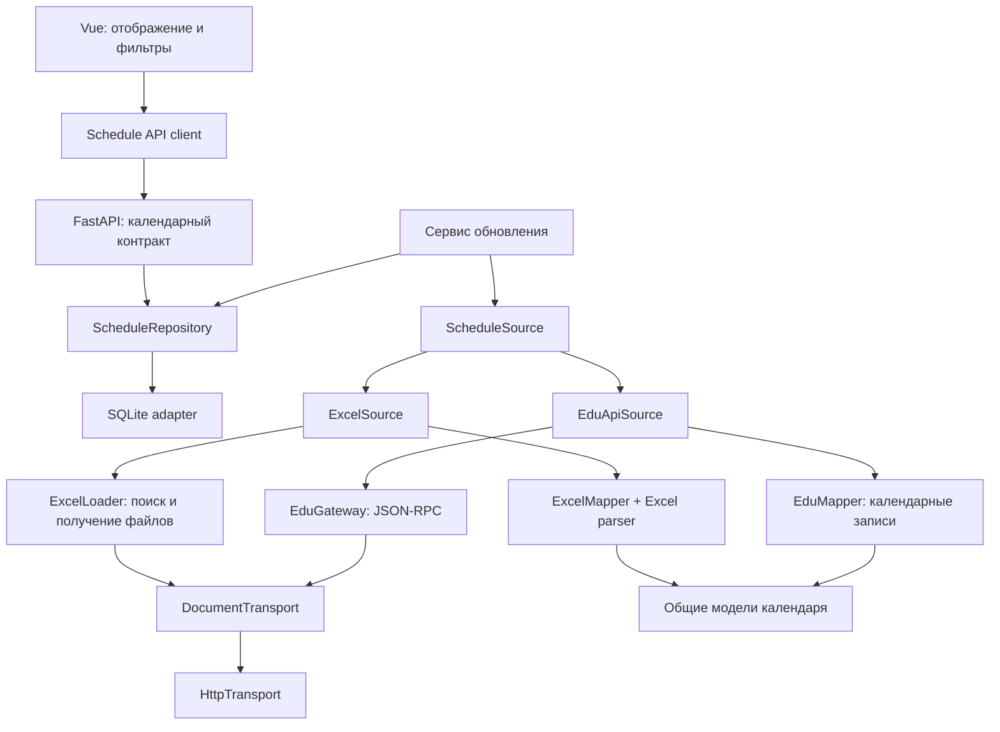

# Архитектура Misisync

Фронтенд работает с календарным контрактом Misisync. Выбор источника, получение файлов и JSON-RPC, преобразование форматов и SQLite разделены. Новая версия не поддерживает старые маршруты, DTO и схему базы.

## Границы ответственности

| Модуль | Отвечает за | Не делает |
| --- | --- | --- |
| `domain.py` | Даты, группы, занятия, происхождение, покрытие и целостность снимка | Сеть, SQL, разбор файлов |
| `ports.py` | Контракты источника, транспорта и хранилища | Выбор конкретных реализаций |
| `transports/http.py` | HTTP, таймауты, ограничение размера ответа, освобождение соединений | JSON-RPC, Excel, запись базы |
| `sources/excel/loader.py` | Поиск официальных ссылок, получение документов через транспорт | Чтение ячеек и SQL |
| `sources/excel/parser.py` | Разбор XLS/XLSX в записи недельного шаблона | Сеть, SQL, API |
| `sources/excel/mapper.py` | Преобразование шаблона в календарь в пределах семестра | Загрузка и SQL |
| `sources/edu/gateway.py` | JSON-RPC envelope и ошибки протокола | Календарные правила и SQL |
| `sources/edu/schemas.py`, `mapper.py` | Проверка структуры ответа, время, подгруппы, неоднозначности | HTTP и SQL |
| `sources/*/source.py` | Последовательность получения и преобразования конкретного источника | Сохранение базы и публичные маршруты |
| `sync.py` | Период обновления, один импорт за раз, получение полного снимка и его публикация | Конкретный источник, парсер, HTTP-клиент или SQL |
| `repositories/sqlite.py` | SQL-транзакции, хранение снимка и согласованное чтение | Сеть и преобразование исходников |
| `composition.py` | Выбор и связывание реализаций | Бизнес-правила расписания |
| `main.py` | Проверка параметров HTTP и выдача общего контракта | Выбор алгоритмов Excel/JSON-RPC |
| `frontend/services/schedule-api.ts` | Запросы общего API | Особенности университетских источников |
| `frontend/composables/useSchedule.ts` | Загрузка, смена недели, отмена устаревших запросов | Парсинг данных источника |

Excel-парсер импортируется фабрикой только при выборе ExcelSource. JSON-RPC адаптер от него не зависит. Пакеты установлены в одном backend-образе для переключения без сборки разных образов.

## Контракт

- `GET /api/groups` возвращает `revision` и массив `groups` с общими полями `id`, `name`, `institutes`, `education_level`, `subgroups`.
- `GET /api/schedule?group_id=...&start=YYYY-MM-DD&end=YYYY-MM-DD` возвращает `group`, `revision`, `source`, `coverage`, запрошенный `window`, `available_dates`, `lessons`, `warnings`. Диапазон ограничен 91 днём.
- `GET /api/status` возвращает фактически сохранённый источник и покрытие, успешное обновление, последнюю ошибку, числа записей и отдельно `configured_source`. При неудачном переключении фактический источник остаётся прежним.
- `GET /api/health` проверяет доступность хранилища.
- `/docs` и `/openapi.json` публикуются FastAPI из моделей `domain.py`.

Каждое занятие имеет конкретную дату, nullable-интервал времени, массивы преподавателей, аудиторий и подгрупп, примечания, предупреждения и исходные записи `evidence`. `id` не является ID университетского занятия: он учитывает дату, группу и вариант записи. Для одинакового ответа ID воспроизводим.

`available_dates` отличает подтверждённо пустой день от дня без загруженных данных. Проверенный API запрашивается за понедельник–субботу; воскресенье не выдаётся за свободный день. За пределами покрытия фронтенд также показывает отсутствие данных. Неизвестная группа возвращается как `group=null`, с пустыми доступными датами.

У Excel `source.basis=weekly_template`: календарь построен по номеру учебной недели, отсчитываемому от понедельника недели `EXCEL_TERM_START`. Семестр ограничен `EXCEL_TERM_END`. Отдельные условия и даты в свободном тексте остаются в исходной записи; их выполнение не симулируется. Интерфейс показывает это ограничение. У API `basis=dated`, даты берутся из ответа.

## Надёжность

Сначала полностью загружаются и проверяются все группы и недели. Один неполный ответ или JSON-RPC error (в том числе при HTTP 200) отменяет обновление целиком. После этого репозиторий одной SQL-транзакцией заменяет группы, занятия, источник, покрытие, время и revision. Ошибка записи откатывает всю транзакцию. Ошибка загрузки меняет только сведения о попытке, сохраняя предыдущий снимок.

Успешный пустой календарь API допустим: он содержит все шесть запрошенных дат с пустыми ячейками. Пустой каталог, пропущенные даты или нераспознанный Excel-файл считаются ошибкой. Чтение расписания вместе с его метаданными выполняется внутри одной read-транзакции.

Дедупликация не объединяет разные типы занятий. Повтор одного университетского ID в нескольких парах сохраняется с предупреждением; поле `in_ceiling` не используется для удаления занятий. Фронтенд может объединить полностью одинаковые варианты подгрупп, сохраняя все исходные записи. Время выбирается из занятия, ячейки или непротиворечивой сетки того же набора звонков. Проверенный московский набор имеет явный резерв времени с предупреждением; другие неизвестные интервалы остаются `null`.

Бэкенд запускается с одним worker: он владеет периодическим импортом. Для отдельного `python -m app` нужно отключить встроенный scheduler, чтобы не запускать независимые обновления одновременно.

## Как заменить реализации

Новый источник реализует `ScheduleSource.fetch(transport, window) -> Snapshot` и получает одну ветку в `composition.py`. Маршруты, репозиторий и фронтенд не меняются. Источник не пишет в базу самостоятельно.

Другое хранилище реализует `ScheduleRepository`; меняется `build_repository`. Источники и их преобразователи не меняются. Другой HTTP-транспорт реализует `DocumentTransport`, возвращающий байтовый `Document`. Для тестов используются транспорта в памяти и воспроизведение HAR без сети.

Другой бэкенд с тем же публичным контрактом подключается через `NUXT_API_BASE` у Nuxt. Если контракт принципиально другой, преобразование размещается в `frontend/services`, а не внутри компонентов. Версионные aliases и старый `/api/catalog` удалены.
