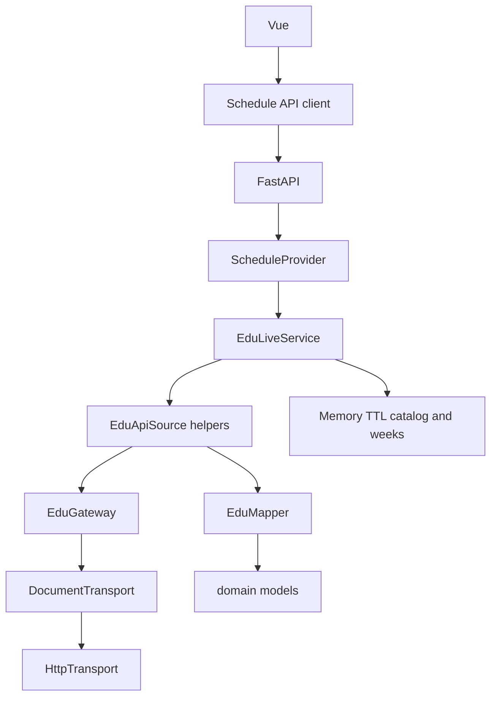

# Архитектура Misisync

Фронтенд работает с календарным контрактом Misisync. Активный бэкенд — live JSON-RPC к `edu.misis.ru`. Источник расписания подключается через порт провайдера; HTTP-транспорт отделён от маппинга.

## Расширение / смена бэкенда

1. Реализовать `ScheduleProvider` (`catalog` / `schedule` / `status`) в новом модуле.
2. Добавить ветку в [`composition.build_provider`](../backend/app/composition.py).
3. Маршруты FastAPI и фронтенд не менять, пока контракт `domain.py` тот же.

Опционально для офлайн/batch-инструментов: `ScheduleSource.fetch(transport, window) -> Snapshot` (как `EduApiSource.fetch` + HAR replay). Это не путь HTTP-сервера.

`SourceInfo.basis` допускает `dated` и `weekly_template` на будущее; сейчас используется только `dated`.

## Границы

| Модуль | Отвечает за | Не делает |
| --- | --- | --- |
| `domain.py` | Календарный контракт | Сеть |
| `ports.py` | `ScheduleProvider`, `DocumentTransport`, опциональный batch `ScheduleSource` | Реализации |
| `transports/http.py` | HTTP, таймауты, лимит размера | JSON-RPC / календарь |
| `sources/edu/gateway.py` | JSON-RPC envelope | Календарные правила |
| `sources/edu/mapper.py` | Время, подгруппы, неоднозначности | HTTP |
| `sources/edu/source.py` | Каталог и недельный `getSchedule` | Публичные маршруты |
| `sources/edu/live.py` | TTL-кэш и ответы для UI | Persistence |
| `composition.py` | Выбор активного провайдера | Бизнес-правила |
| `main.py` | HTTP-контракт | Выбор алгоритма источника |

## Контракт

- `GET /api/groups` — `{revision, groups}`
- `GET /api/schedule?group_id=&start=&end=` — календарь на окно (≤ 91 день)
- `GET /api/status` — метаданные live-провайдера
- `GET /api/health` — liveness

Каталог: `getFillialInfo` + TTL. Расписание: `getSchedule` по запрошенным неделям + TTL. `EDU_GROUPS` фильтрует только имена в каталоге.

Неизвестная группа: `group=null`, пустые даты. Воскресенье не входит в покрытие источника (пн–сб).
